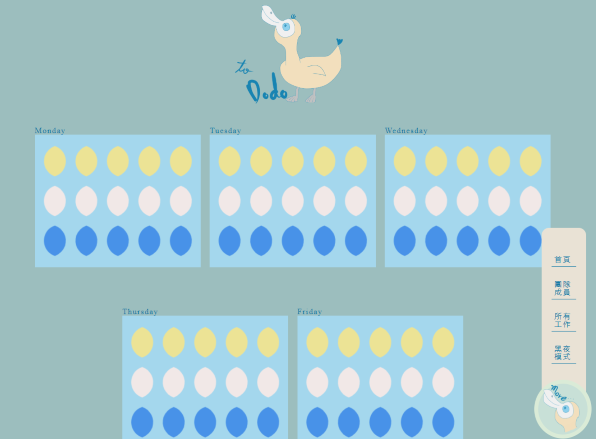
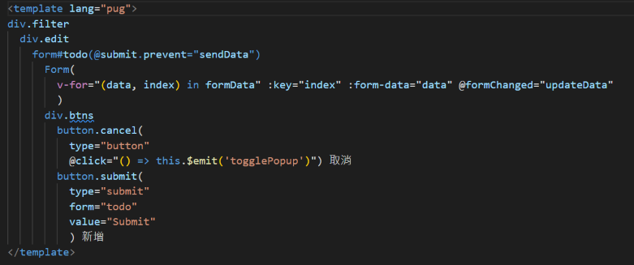

# To Dodo 渡渡鳥日程紀錄網站
## 專案架構與規劃

面對眾多待辦事項時，大部分人都會感到有壓力、厭煩，因此以Dodo鳥為主題，搭配活潑的色調與元素，希望能製作一個讓使用者在管理日程時保有好心情的網站！

目前許多資料、架構仍在規劃與建構當中，但網站主要分為三大架構：
### 1. 日程預覽(如/home與/works/:day頁面所示)
* 預覽日程：將一天的時間分為15區段，長方形框內的每顆蛋代表1小時，並將畫面與todos資料綁定，讓使用者在進入網站時，能一眼就看出當週行程的空閒程度(資料尚未綁定)
* 觀看詳細日程：點擊長方形框，即可看見該日的待辦事項，並新增、修改工作事項(修改功能尚未開啟)

### 2. 團隊成員(/members，頁面建構中)
* 瀏覽團隊成員：能看見團隊成員的資料以及主要待辦事項(已先套用簡易假資料)
* 瀏覽團隊成員日程：點擊團隊成員，能連進成員的時程首頁(架構如/home，只不過資料全是該名成員的資料；規劃中)

### 3. 所有工作(/works，頁面建構中)
* 能預覽團隊或個人所有的工作，並能依據時間、優先程度等做排序
<br>



### [***點這裡看網站！](https://to-dodo-6ceb2.web.app/#/)

<br>

## 開發重點與設計
#### 1. 以SCSS取代CSS：
* 使用vue.config.js、main.js載入共通樣式，統一管理mixin、顏色樣式等，讓程式碼更簡潔，也方便後續維護
#### 2. component使用：
* 將頁面中重複的元素以component管理，例如sidebar、popup、表單等，方便重複使用，也讓程式碼更簡潔
<br>


<br>
以新增、修改todos的EditPopup為例，由於text、textarea、radio等不同形式的表單已被統一存入WorksForms元件中，只要透過傳入相對應的props就能直接引用，因此可以預先將所有的props資料存在formData當中，再使用v-for依formData產出表單。如此一來，即使引用的表單類型眾多，template也能維持簡潔。

#### 3. text、radio、select等表單運用：
* 如前項所述，將不同表單形式統一存在WorksForms當中，再利用props去選擇想使用的格式。

props範例：
```
<!-- WorksForms.vue的props -->
{
  dataName: 'textData',
  data: {
    label: '名稱',
    placeholder: '請輸入todo名稱',
    name: 'title'
  }
}
```

props分為dataName、data兩部分，dataName用來告訴WorksForms使用者要使用的是哪一種類型的表單，data則存放該類型表單需要放置的資料。
* 使用v-model綁定表單，並使用watch監控表單內容是否改變，當表單內容改變時，再利用$emit將資料傳到父元件

```
<!-- WorksForms.vue -->
methods: {
    sendData () {
      const dataSent = {
        name: this.data.name,
        data: this.newData
      }
      this.$emit('formChanged', dataSent)
    }
  },
  watch: {
    newData () {
      this.sendData()
    }
  }
```

#### 4. 使用computed整理資料

```
<!-- WorksDayPage.vue -->
computed: {
    newTodos () {
      // sort todos based on time
      const todoArr = Object.values(this.todos).sort((firstTodo, secondTodo) => 
        firstTodo.time - secondTodo.time
      )
      // convert time to real time
      const realTime = {
        1 : '7:00-8:00',
        2: '8:00-9:00',
        3: '9:00-10:00',
        ...
      }
      const newTodo = todoArr.map(function(todo) { 
        return {
          ...todo,
          time: realTime[todo.time]
        } 
      }
      )
      return newTodo
    }
  },
```

此為WorksDayPage中的程式碼。由於原始資料並未按照todo的時間排序，且原始資料中只以1、2、3等編號記錄todo的時段，因此使用computed轉換原始資料，並作為渲染依據。
#### 5. 使用Vue Router設計路由
* 能依據路由切換到不同的頁面
* 針對如WorksDayPage這類只顯示某部分資料的頁面，以this.$route.params當作頁面標題、頁面資料的依據

```
<!-- WorksDayPage.vue -->
beforeMount () {
  const day = this.$route.params.day
  this.todos = this.$store.state.data[day]
}
```

此為WorksDayPage的部分程式碼，由於該頁面只需顯示星期一、星期二等特定一天的todos，且頁面架構都相同，因此使用動態路由的方式依params改變頁面內容

#### 6. 全域參數應用
* 使用global變數搭配CSS變數切換日間、夜間模式

```
<!-- main.js -->
Vue.prototype.$theme = 'light'
```
* 與頁面資料相關的共通資料則存入Vuex中供各元件調動

#### 7. 使用axios串接團隊成員資料
* 使用Vuex的actions呼叫資料，存入state當中，需要使用時，再使用this.$store.state.memberList讀取資料

```
<!-- store的index.js -->
actions: {
    async fetchMembers(state) {
      try {
        const response = await axios.get(' https://mocki.io/v1/d4867d8b-b5d5-4a48-a4ab-79131b5809b8');
        // change the form of the data
        const rawData = response.data
        state.commit('getMembers', rawData)
      } catch (error) {
        console.error(error);
      }
    }
  }
```
#### 8. 使用Firebase Hosting架設網站
* 網址：https://to-dodo-6ceb2.web.app/#/

## 技術與環境
#### pug： 簡化HTML結構
#### SCSS：撰寫內容樣式
#### Vue：製作SPA網站
#### Vue Router：設計路由
#### Vuex：管理共同資料
#### Axios：從後端抓取假資料
#### Firebase：使用hosting架設網站

